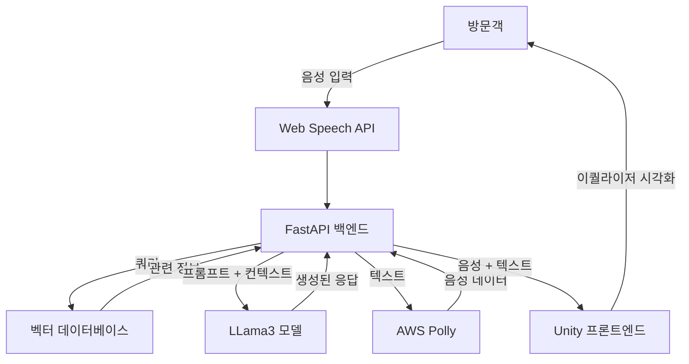

# AI 디지털 도슨트: 미래 교육의 혁신적 안내자

  
  
  
  
  

  

## 📚 목차
1. [프로젝트 개요](#-프로젝트-개요)
2. [주요 기능](#-주요-기능)
3. [기술 스택](#-기술-스택)
4. [시스템 아키텍처](#-시스템-아키텍처)
5. [개발 기간](#-개발-기간)
6. [개발자 정보](#-개발자-정보)

## 🎨 프로젝트 개요

AI 디지털 도슨트는 최첨단 AI 기술을 활용하여 방문객들에게 개인화된 안내 서비스를 제공하는 혁신적인 시스템입니다. 이 프로젝트는 자연어 처리, 음성 인식 및 합성 기술을 결합하여 방문객들과 자연스러운 대화를 나누며, 센터의 다양한 전시물과 주제에 대해 심도 있는 설명을 제공합니다.

### 💡 개발 배경
전통적인 안내 서비스의 한계를 극복하고, 4차 산업혁명 시대에 걸맞은 미래지향적 학습 경험을 제공하고자 본 프로젝트를 기획하였습니다. AI 기술의 발전을 교육 분야에 적용함으로써, 방문객들에게 더욱 풍부하고 인터랙티브한 학습 기회를 제공하는 것이 목표입니다.

## 🚀 주요 기능

1. **음성 기반 상호작용**
   - 웨이크워드 감지 시스템으로 간편한 대화 시작
   - AWS Polly를 이용한 자연스러운 음성 합성(TTS)
   - Web Speech API를 활용한 실시간 음성 인식(STT)

2. **지능형 대화 시스템**
   - LLama3 모델 기반의 고급 자연어 처리
   - 맥락을 고려한 지능적 응답 생성
   - 개인화된 정보 제공 및 질문 응답

(html 파일은 텍스트를 시각화 하기위해 넣어놨습니다)

3. **실시간 시각적 피드백**
   - Unity 기반 동적 이퀄라이저로 음성 출력 시각화
   - 사용자 친화적 인터페이스로 몰입감 증대

4. **확장 가능한 지식 베이스**
   - 벡터 데이터베이스를 활용한 효율적인 정보 검색 및 관리
   - LangChain을 이용한 유연한 AI 파이프라인 구축

(html 파일은 텍스트를 시각화 하기위해 넣어놨습니다)

5. **멀티모달 학습 지원**
   - 음성, 텍스트, 시각적 요소를 결합한 종합적 학습 경험 제공

## 🛠 기술 스택

| 분야 | 기술 |
|------|------|
| 프론트엔드 |  |
| 백엔드 |   |
| 음성 합성 (TTS) |  |
| 음성 인식 (STT) | Web Speech API |
| AI 모델 |  (Ollama 활용) |
| 벡터 데이터베이스 |  |
| AI 파이프라인 |  |
| 시각화 | Unity 커스텀 이퀄라이저 |

## 📐 시스템 아키텍처

## ⏳ 개발 기간
- 전체 개발 기간: 2024-09-10 ~ 2024-09-24

## 👨‍💻 개발자 정보

<table>
  <tr>
    <td align="center">
      <a href="https://github.com/chanhyuckkim">
         
        <b>김찬혁</b>
      </a>
    </td>
  </tr>
</table>
---
